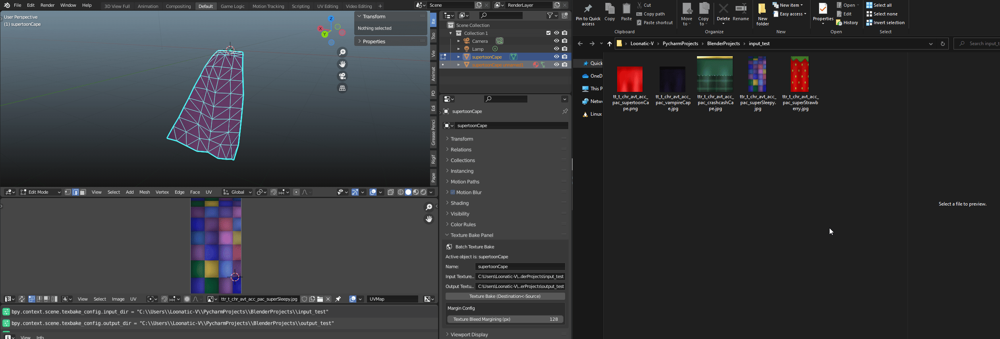

# BatchTextureBaker

A small Blender add-on that takes an input directory of texture maps, bakes them onto another UV map, and then saves them into the output directory.

Currently, this tool only supports operations with two identical meshes selected.

## Demo

